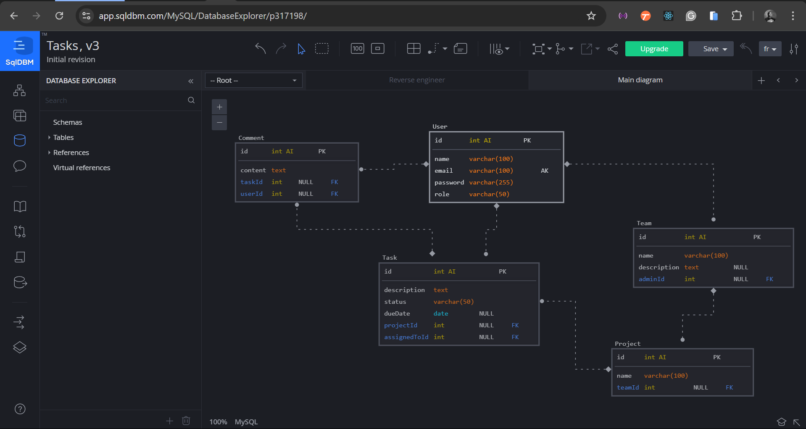

# Project Database Schema

This project represents a simple task management system with the following core entities:
- Users
- Teams
- Projects
- Tasks
- Comments

Below is the Entity-Relationship Diagram (ERD) that shows how these entities are related:

## Table Relationships and Data Flow

### 1. **User Table**
   - The `User` table holds information about users who can be assigned roles such as admin or team members. Each user has:
     - An `id` (primary key).
     - `name`, `email`, `password`, and `role`.

### 2. **Team Table**
   - The `Team` table represents a collection of users, with one user designated as the admin. The admin for each team is linked via the `adminId` foreign key.
     - A `Team` can have multiple users, but each team has one `admin` who manages it.
     - The relationship between `User` and `Team` is one-to-many, where one user (the admin) can oversee multiple teams.

### 3. **Project Table**
   - The `Project` table defines various projects that a team works on. Each project is linked to a specific team using the `teamId` foreign key.
     - A `Team` can have multiple `Projects`, establishing a one-to-many relationship between `Team` and `Project`.

### 4. **Task Table**
   - The `Task` table tracks individual tasks for a project. Tasks are linked to:
     - A project (`projectId` foreign key), and
     - A user who is assigned the task (`assignedToId` foreign key).
     - The relationship between `Project` and `Task` is one-to-many, meaning a project can have multiple tasks.
     - The relationship between `User` and `Task` is also one-to-many, as one user can be assigned multiple tasks.

### 5. **Comment Table**
   - The `Comment` table allows users to leave comments on tasks. Each comment is associated with:
     - A specific task (`taskId` foreign key), and
     - A user who made the comment (`userId` foreign key).
     - The relationships here are one-to-many, as a task can have multiple comments, and a user can leave multiple comments on various tasks.

## Data Flow

- **User and Team**: 
   - A user can create and manage multiple teams, where each team has its own projects. 
   - Each team can have one or more users, with one user designated as the admin (`adminId`).
  
- **Team and Project**:
   - Teams are responsible for managing multiple projects. A project is always associated with a specific team (`teamId`).

- **Project and Task**:
   - Each project can have multiple tasks. Tasks are defined and assigned to specific users, and users can manage tasks, update their status, and set deadlines (`assignedToId`).

- **Task and Comment**:
   - Tasks can have multiple comments from users. Each comment is related to a task and a specific user who posts it (`taskId`, `userId`).

## Getting Started

To understand the database structure and relationships better, use this model to reverse-engineer in tools like **SQLDBM**, where you can visualize the tables, relationships, and data flow as described.
